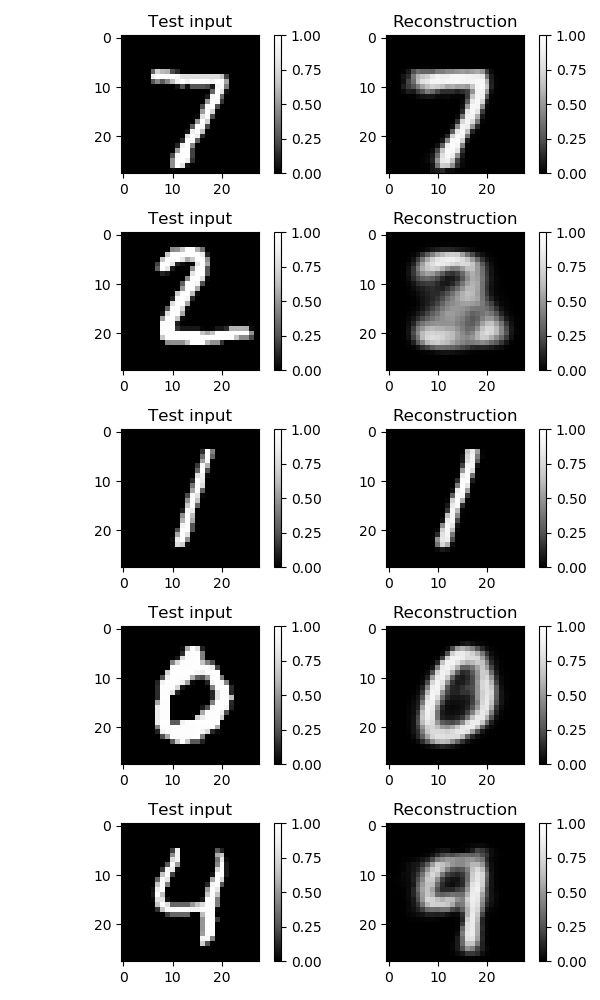
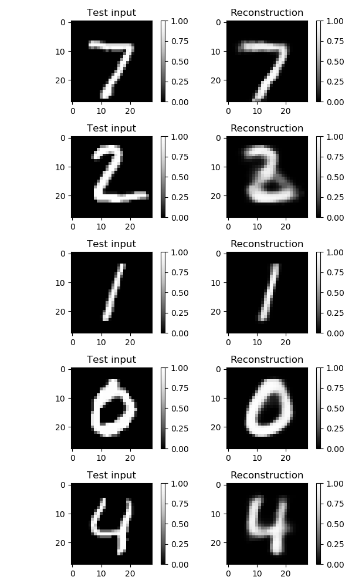
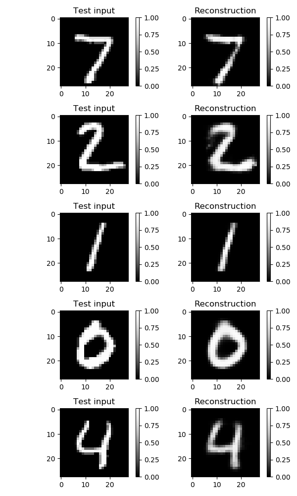
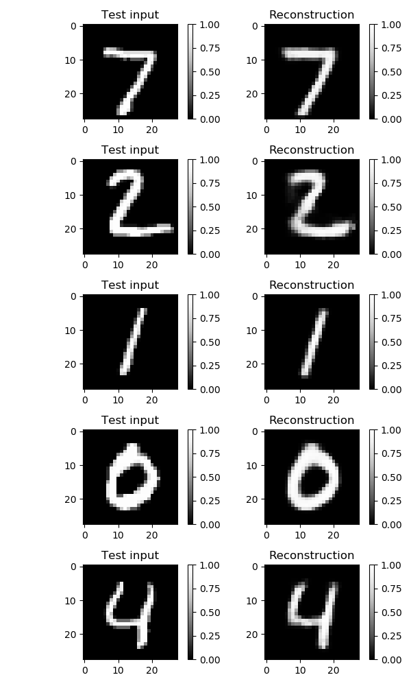
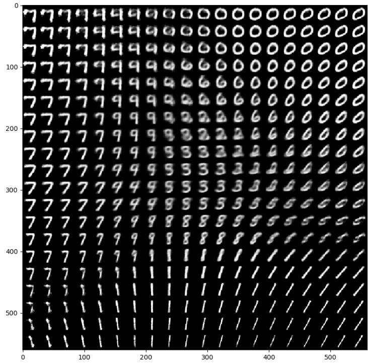
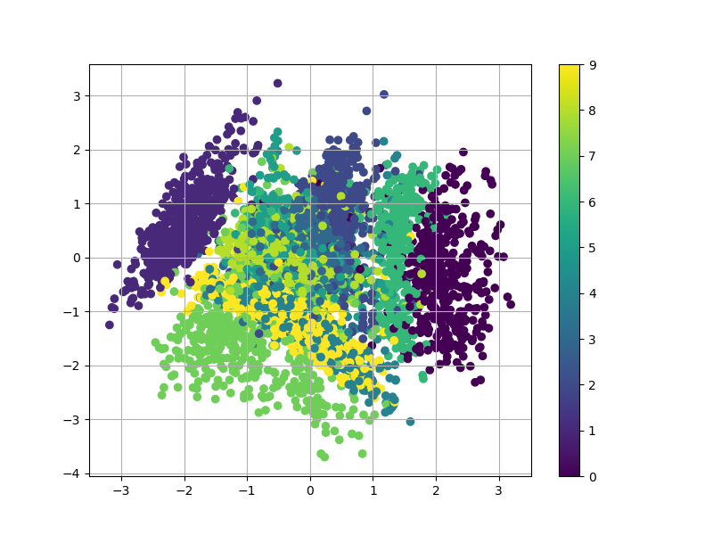

## Reconstructions with `n_z=2,5,10,20`
使用不同的隐空间维数训练VAE后，观察其对测试集上的图像样本`x`的重构效果。隐空间维数`n_z`越大，重构图像越清晰.

   

## Getting insights into the latent space
在区间[-3,3]内均匀采样得到不同的隐变量`z`，然后通过生成网络(decoder network)产生的`E[x|z]`.

## Another way of getting insights into the latent space
将测试集上的每个样本`x`通过推断网络(encoder network)映射到2维的隐变量空间，图中的每个点表示`E[z|x]`，不同的颜色表示不同的数字.

